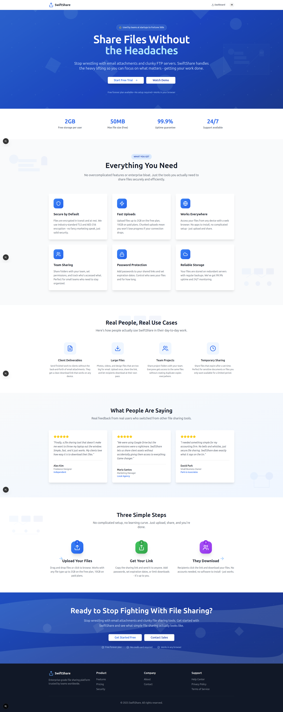
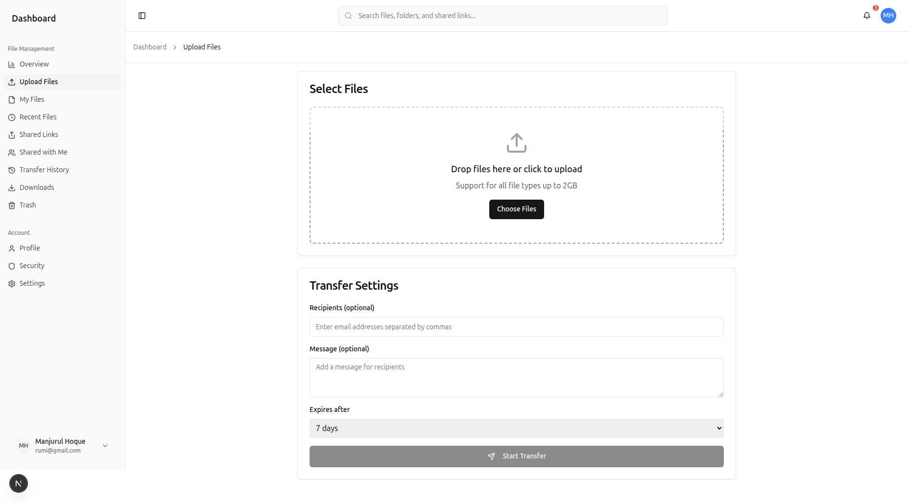

# Swift Share 🚀

A modern, secure file sharing platform built for teams and individuals who need reliable, fast, and secure file management without the enterprise bloat.

   

## ✨ What Makes Swift Share Different?

Unlike other file sharing platforms that overwhelm you with features you'll never use, Swift Share focuses on what actually matters: **secure, fast, and reliable file sharing** that just works. No complicated setup, no enterprise jargon - just clean, intuitive file management.

## 📸 Screenshots

See Swift Share in action with these screenshots showcasing the clean, intuitive interface:

<div align="center">

### 🏠 Homepage


*Clean, modern homepage with clear value proposition and feature highlights*

### 📊 Dashboard Overview


*Intuitive dashboard with file management, sharing controls, and activity overview*

### 📁 File Management


*Organized file browser with drag-and-drop upload, folder management, and sharing options*

</div>

## 🎯 Core Features

### 🔒 **Security First**
- **AES-256 encryption** at rest and in transit
- **Password-protected shares** with expiration dates
- **JWT-based authentication** with secure session management
- **Comprehensive audit logging** for compliance
- **Role-based access control** for team collaboration

### ⚡ **Lightning Fast**
- **Chunked uploads** up to 2GB (free) / 10GB (paid)
- **Resume interrupted uploads** - never lose progress
- **Global CDN** for fast downloads worldwide
- **Smart compression** and parallel processing
- **Instant file previews** for 100+ file types

### 👥 **Team Collaboration**
- **Real-time collaboration** with live updates
- **Granular permissions** - control who sees what
- **Version history** and file versioning
- **Team workspaces** with shared folders
- **Advanced sharing** with custom expiration and access controls

### 📱 **Works Everywhere**
- **Responsive web interface** - no apps to install
- **Mobile-optimized** for smartphones and tablets
- **Cross-platform** - works on any device with a browser
- **Offline access** to recently viewed files

## 🛠 Tech Stack

### Backend
- **Go 1.23** - High-performance, concurrent backend
- **Gin Framework** - Fast HTTP web framework
- **GORM** - Powerful ORM with multi-database support
- **JWT Authentication** - Secure token-based auth
- **PostgreSQL/MySQL/SQLite** - Flexible database options
- **AWS S3 Integration** - Scalable cloud storage
- **Swagger/OpenAPI** - Comprehensive API documentation

### Frontend
- **Next.js 15.2** - React framework with SSR/SSG
- **TypeScript 5.5** - Type-safe development
- **Tailwind CSS** - Utility-first styling
- **Radix UI** - Accessible component primitives
- **React Hook Form** - Performant form handling
- **Redux Toolkit** - Predictable state management
- **Framer Motion** - Smooth animations

### DevOps & Infrastructure
- **Docker** - Containerized deployment
- **CORS Support** - Cross-origin resource sharing
- **Environment Configuration** - Flexible config management
- **Comprehensive Logging** - Detailed audit trails

## 🏗 Architecture

```
swift-share/
├── backend/                 # Go API server
│   ├── cmd/server/         # Application entry point
│   ├── controllers/        # HTTP request handlers
│   ├── models/            # Database models & schemas
│   ├── services/          # Business logic layer
│   ├── middleware/        # Authentication, CORS, logging
│   ├── storage/          # File storage abstraction (S3/Local)
│   └── routes/           # API route definitions
├── frontend/              # Next.js web application
│   ├── app/              # App router pages
│   ├── components/       # Reusable UI components
│   ├── store/            # Redux state management
│   └── lib/              # Utilities and API clients
```

## 🚀 Quick Start

### Prerequisites
- Go 1.23+
- Node.js 18+
- PostgreSQL/MySQL/SQLite
- (Optional) AWS S3 credentials

### Backend Setup
```bash
cd backend
go mod download
cp .env.example .env
# Configure your database and storage settings
go run cmd/server/main.go
```

### Frontend Setup
```bash
cd frontend
npm install
npm run dev
```

Visit `http://localhost:3000` to see Swift Share in action!

## 📊 Database Models

Swift Share uses a comprehensive data model supporting:

- **Users** - Authentication, profiles, and permissions
- **Files** - Metadata, versions, and access control
- **Folders** - Hierarchical organization with sharing
- **Share Links** - Secure, time-limited sharing
- **Collaborators** - Team access management
- **Audit Logs** - Complete activity tracking
- **Downloads** - Analytics and usage statistics

## 🔧 Configuration

The application supports flexible configuration through environment variables:

```bash
# Database
DB_HOST=localhost
DB_PORT=5432
DB_NAME=swift_share
DB_USER=postgres
DB_PASSWORD=password

# Storage (S3 or Local)
STORAGE_DRIVER=s3
S3_BUCKET=your-bucket
S3_REGION=us-east-1

# Security
JWT_SECRET=your-secret-key
BCRYPT_COST=12
```

## 📈 Features Roadmap

- [ ] **Mobile Apps** - Native iOS and Android apps
- [ ] **Advanced Analytics** - Detailed usage insights
- [ ] **SSO Integration** - Google, Microsoft, SAML
- [ ] **API Webhooks** - Real-time event notifications
- [ ] **Bulk Operations** - Mass file management
- [ ] **Scheduled Sharing** - Time-based file releases

## 🤝 Contributing

We welcome contributions! Please see our [Contributing Guidelines](CONTRIBUTING.md) for details.

1. Fork the repository
2. Create a feature branch (`git checkout -b feature/amazing-feature`)
3. Commit your changes (`git commit -m 'Add amazing feature'`)
4. Push to the branch (`git push origin feature/amazing-feature`)
5. Open a Pull Request

## 📄 License

This project is licensed under the MIT License - see the [LICENSE](LICENSE) file for details.

## 🙏 Acknowledgments

- Built with ❤️ using Go, React, and modern web technologies
- Inspired by the need for simple, secure file sharing
- Thanks to all contributors and the open-source community

---

**Ready to share files the smart way?** [Get started now](https://github.com/manjurulhoque/swift-share) or [view the live demo](https://swift-share-demo.vercel.app).

*No enterprise bloat. No complicated setup. Just fast, secure file sharing that works.*
